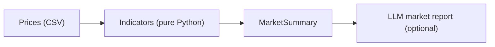

# 🌾 Agro Commodity Insights


Analyze **agricultural commodity** price series with a pure-Python indicators
engine (moving averages, momentum, volatility, trend) and turn the numbers into
a **narrative market report** with an LLM.

> Agribusiness AI portfolio piece — and a bridge to my finance/markets work. The
> analytics are **pure-Python and fully tested** (no pandas/numpy); only the
> report narration uses an LLM, grounded strictly in the computed indicators.

## ✨ Features

- **Indicators with no heavy deps** — SMA(5)/SMA(20), 1- and 30-period % change,
  return volatility, trend (SMA crossover), period high/low.
- **Grounded LLM market report** — describes trend, momentum, volatility, and key
  levels from the numbers only (no invented prices/news).
- **CSV in, insight out** — bring any `date,price` series.

## 🏗️ Architecture



Details in [`docs/architecture.md`](docs/architecture.md).

## 🚀 Quickstart

```bash
pip install -e .

# 1. Analyze the sample soybean series — fully offline, no key
python scripts/analyze.py --csv data/soybean_prices.csv --name Soybean
```

Output:

```
Soybean  (32 points)
  latest        1430.0
  1-period      -0.56%
  ~30-period    +7.92%
  SMA(5)/SMA(20) 1429.6 / 1405.3
  volatility    0.61%
  trend         up
  high / low    1438.0 / 1318.0
```

```bash
# 2. Generate a narrative market report (needs an API key)
cp .env.example .env       # add ANTHROPIC_API_KEY
python scripts/report.py --csv data/soybean_prices.csv --name Soybean
```

## 🗂️ Project structure

```
agro-commodity-insights/
├── src/agromarket/
│   ├── indicators.py   # SMA, % change, volatility, trend  ← the core
│   ├── analyze.py      # series -> MarketSummary
│   ├── data_io.py      # load CSV
│   └── report.py       # LLM market report (optional)
├── data/soybean_prices.csv
├── scripts/            # analyze.py (offline), report.py (LLM)
└── tests/              # indicators + analyze, no key
```

## ✅ Tests

```bash
pytest -q     # indicators + analysis, fully offline
```

## 🧭 Roadmap

- [x] Pure-Python indicators + analysis summary
- [x] Grounded LLM market report
- [ ] More indicators (RSI, Bollinger bands) + multi-commodity comparison
- [ ] Live data feed integration
- [ ] Charts + a small dashboard

## 📄 License

MIT — see [LICENSE](LICENSE).

---

Built by **Arturio Amorim Sobrinho** — AI/LLM Engineer.
[GitHub](https://github.com/arturio-amorim) · [LinkedIn](https://www.linkedin.com/in/arturio-amorim-33b60736/)
