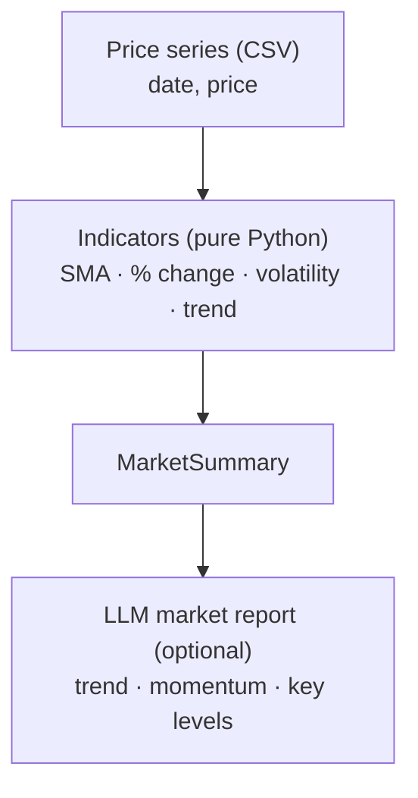

# Architecture

## Indicators (no pandas/numpy)

- **SMA(5) / SMA(20)** — short vs long moving averages.
- **% change** — 1-period and ~30-period momentum.
- **Volatility** — standard deviation of period-over-period returns.
- **Trend** — `up` / `down` / `flat` from the SMA(5) vs SMA(20) crossover.
- **High / low** — period extremes.

All implemented in plain Python over lists, so they're trivial to unit-test and
have zero heavy dependencies.

## Design choices

- **Deterministic analytics, then narration.** The numbers come from a tested,
  reproducible core; the LLM only *describes* them — it can't move the market.
- **Grounded reports.** The report prompt is fed only the computed indicators, so
  it can't invent prices or news.
- **Ties to my finance work.** Same time-series-analytics + grounded-LLM pattern
  as a markets desk, applied to agribusiness commodities.
